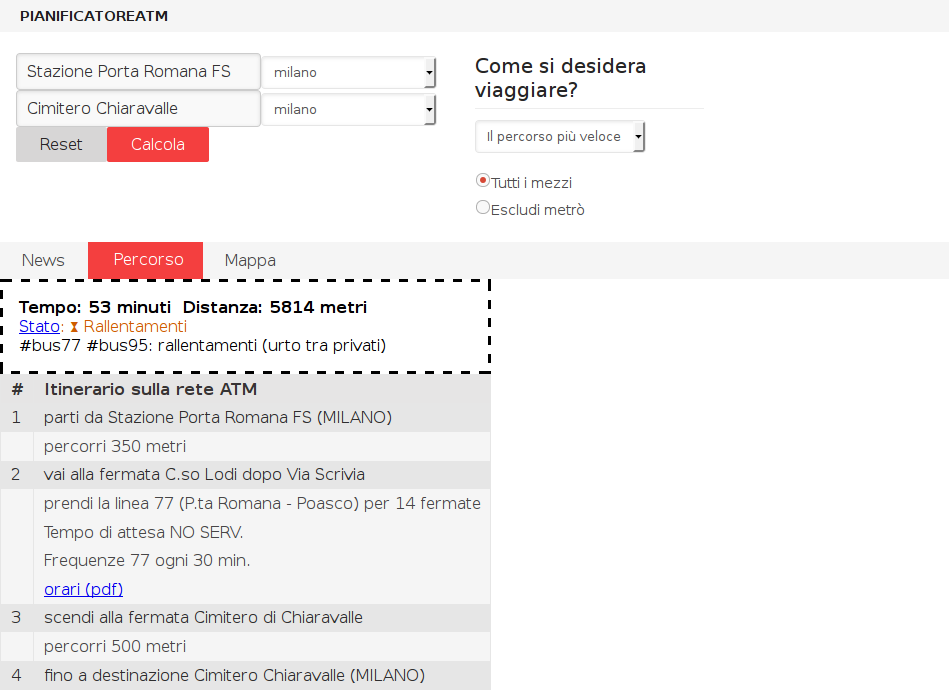

pianificatoreatm
================

Un pianificatore di percorsi su rete ATM-Milano che integra informazioni da Twitter. È prevista l'integrazione dei risultati di ricerca tramite il sistema GiroMilano con considerazioni relative ai rallentamenti, modifiche o interruzioni del servizio pubblicate su Twitter

